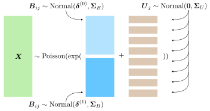

```{r setup, include=FALSE}
knitr::opts_chunk$set(echo = TRUE, warning = FALSE, message = FALSE, fig.retina = 2, dpi = 96, fig.width = 7.2916667, fig.asp = 0.6178571)
```

# Introduction

Flow and mass cytometry are important modern immunology tools for measuring expression levels of multiple proteins on single cells. The goal is to better understand the mechanisms of responses on a single cell basis by studying differential expression of proteins. Most current data analysis tools compare expressions across many computationally discovered cell types. Our goal is to focus on just one cell type. Differential analysis of marker expressions can be difficult due to marker correlations and inter-subject heterogeneity, particularly for studies of human immunology. We address these challenges with two multiple regression strategies: A generalized linear mixed model (GLMM) and a bootstrapped generalized linear model (GLM). Here, we illustrate the `CytoGLMM` _R_ package and workflow for simulated mass cytometry data.

# Prepare Simulated Data

We construct our simulated datasets by sampling from a Poisson GLM. We confirmed---with predictive posterior checks---that Poisson GLMs with mixed effects provide a good fit to mass cytometry data [@seiler2019uncertainty]. We consider one underlying data generating mechanisms described by a hierarchical model for the $i$th cell and $j$th donor:

$$
\begin{aligned}
\boldsymbol{X}_{ij} & \sim \text{Poisson}(\boldsymbol{\lambda}_{ij}) \\
\log(\boldsymbol{\lambda}_{ij}) & = \boldsymbol{B}_{ij} + \boldsymbol{U}_j \\
\boldsymbol{B}_{ij} & \sim
\begin{cases} 
\text{Normal}(\boldsymbol{\delta}^{(0)}, \boldsymbol{\Sigma}_B) & \text{if } Y_{ij} = 0, \text{ cell unstimulated} \\
\text{Normal}(\boldsymbol{\delta}^{(1)}, \boldsymbol{\Sigma}_B) & \text{if } Y_{ij} = 1, \text{ cell stimulated}
\end{cases} \\
\boldsymbol{U}_j & \sim \text{Normal}(\boldsymbol{0}, \boldsymbol{\Sigma}_U).
\end{aligned}
$$

The following graphic shows a representation of the hierarchical model.



The stimulus activates proteins and induces a difference in marker expression. We define the effect size to be the difference between expected expression levels of stimulated versus unstimulated cells on the $\log$-scale. All markers that belong to the active set \textcolor{red}{$C$}, have a non-zero effect size, whereas, all markers that are not, have a zero effect size:

$$
\begin{cases}
\delta^{(1)}_p - \delta^{(0)}_p > 0 & \text{if protein } p \text{ is in activation set } p \in C \\
\delta^{(1)}_{p'} - \delta^{(0)}_{p'} = 0 & \text{if protein } p' \text{ is not in activation set } p' \notin C.
\end{cases}
$$

Both covariance matrices have an autoregressive structure, 

$$
\begin{aligned}
\Omega_{rs} & = \rho^{|r-s|} \\ 
\boldsymbol{\Sigma} & = \operatorname{diag}(\boldsymbol{\sigma}) \, \boldsymbol{\Omega} \, \operatorname{diag}(\boldsymbol{\sigma}),
\end{aligned}
$$

where $\Omega_{rs}$ is the $r$th row and $s$th column of the correlation matrix $\boldsymbol{\Omega}$. We regulate two separate correlation parameters: a cell-level $\rho_B$ and a donor-level $\rho_U$ coefficient. Non-zero $\rho_B$ or $\rho_U$ induce a correlation between condition and marker expression even for markers with a zero effect size.

```{r simulated_data}
library("CytoGLMM")
library("magrittr")
set.seed(23)
df = generate_data()
df[1:5,1:5]
```

We define the marker names that we will focus on in our analysis by extracting them from the simulated data frame.

```{r protein_names}
protein_names = names(df)[3:12]
```

We recommend that marker expressions be corrected for batch effects [@nowicka2017cytof; @chevrier2018compensation; @schuyler2019minimizing; @van2020cytonorm; @trussart2020removing] and transformed using variance stabilizing transformations to account for heteroskedasticity, for instance with an inverse hyperbolic sine transformation with the cofactor set to 150 for flow cytometry, and 5 for mass cytometry [@bendall2011single]. This transformation assumes a two-component model for the measurement error [@rocke1995two; @huber2003parameter] where small counts are less noisy than large counts. Intuitively, this corresponds to a noise model with additive and multiplicative noise depending on the magnitude of the marker expression; see [@holmes2019modern] for details.

```{r transform}
df %<>% dplyr::mutate_at(protein_names, function(x) asinh(x/5))
```

# GLM

The goal of the `CytoGLMM::cytoglm` function is to find protein expression patterns that are associated with the condition of interest, such as a response to a stimulus. We set up the GLM to predict the experimental condition (`condition`) from protein marker expressions (`protein_names`), thus our experimental conditions are response variables and marker expressions are explanatory variables.

```{r glm_fit}
glm_fit = CytoGLMM::cytoglm(df,
                            protein_names = protein_names,
                            condition = "condition",
                            group = "donor",
                            num_cores = 1,
                            num_boot = 1000)
glm_fit
```

We plot the maximum likelihood estimates with 95\% confidence intervals for the fixed effects $\boldsymbol{\beta}$. The estimates are on the $\log$-odds scale. We see that markers m1, m2, and m3 are strong predictors of the treatment. This means that one unit increase in the transformed marker expression makes it more likely to be a cell from the treatment group, while holding the other markers constant.

```{r glm_plot}
plot(glm_fit)
```

The `summary` function returns a table about the model fit with unadjusted and Benjamini-Hochberg (BH) adjusted $p$-values.

```{r glm_summarize}
summary(glm_fit)
```

We can extract the proteins below an False Discovery Rate (FDR) of 0.05 from the $p$-value table by filtering the table.

```{r glm_p_values}
summary(glm_fit) %>% dplyr::filter(pvalues_adj < 0.05)
```

In this simulated dataset, the markers m2 and m3 are below an FDR of 0.05.

# GLMM

In the `CytoGLMM::cytoglmm` function, we make additional modeling assumptions by adding a random effect term in the standard logistic regression model to account for the subject effect (`group`). In paired experimental design---when the same donor provides two samples, one for each condition---`CytoGLMM::cytoglmm` is statistically more powerful.

```{r glmm_fit}
glmm_fit = CytoGLMM::cytoglmm(df,
                              protein_names = protein_names,
                              condition = "condition",
                              group = "donor",
                              num_cores = 1)
glmm_fit
```

We plot the method of moments estimates with 95\% confidence intervals for the fixed effects $\boldsymbol{\beta}$.

```{r glmm_plot}
plot(glmm_fit)
```

The `summary` function returns a table about the model fit with unadjusted and BH adjusted $p$-values.

```{r glmm_summarize}
summary(glmm_fit)
```

We can extract the proteins below an FDR of 0.05 from the $p$-value table by filtering the table.

```{r glmm_p_values}
summary(glmm_fit) %>% dplyr::filter(pvalues_adj < 0.05)
```

In this simulated dataset, the markers m1, m2 and m3 are below an FDR of 0.05. This illustrates the improved power for paired samples as `CytoGLMM::cytoglmm` correctly detects all three differentially expressed proteins. We performed extensive power simulations and comparisons to other methods in @seiler2021cytoglmm.

# Session Info {.unnumbered}

```{r session_info}
sessionInfo()
```

# References
