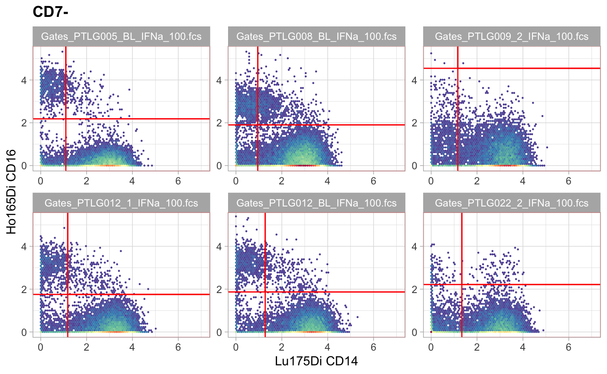
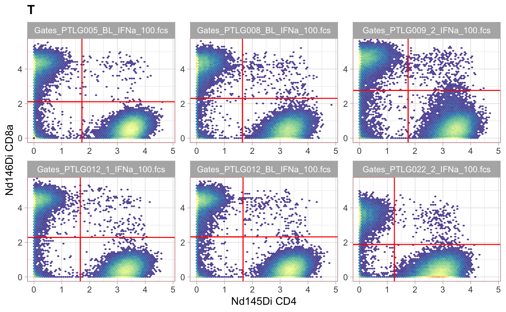
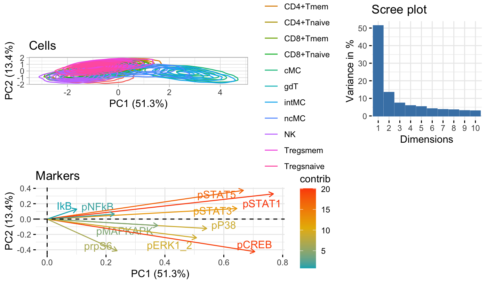
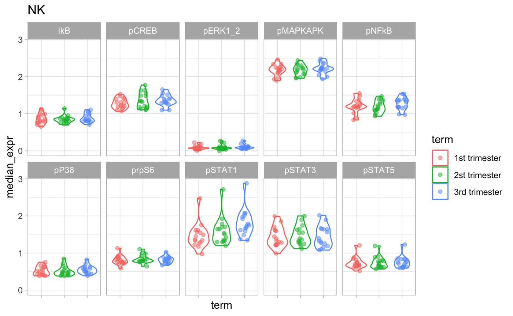
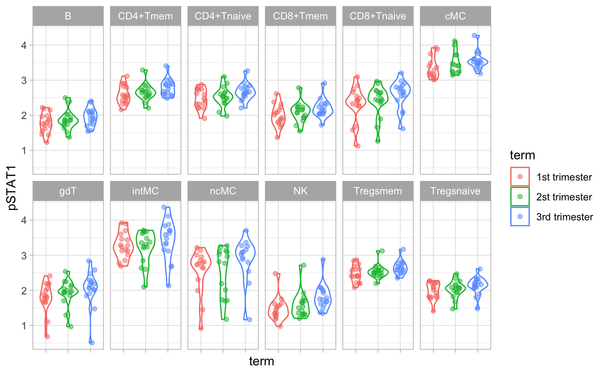
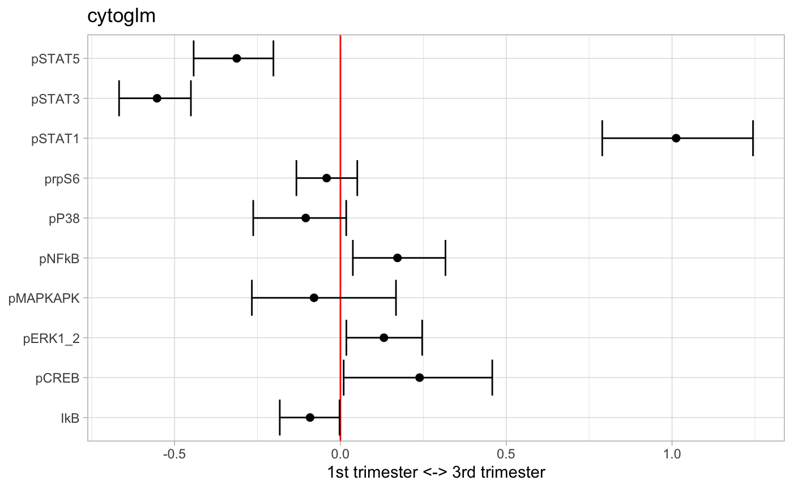
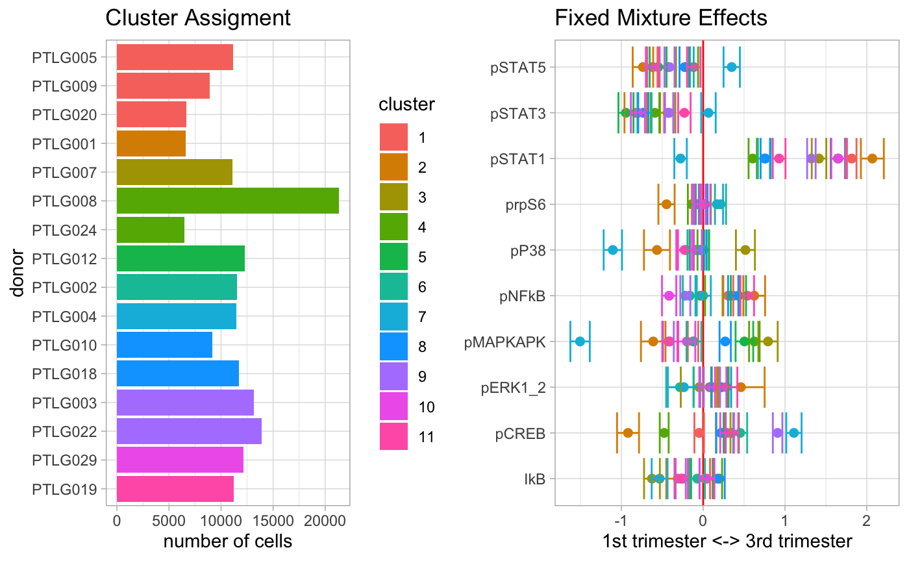
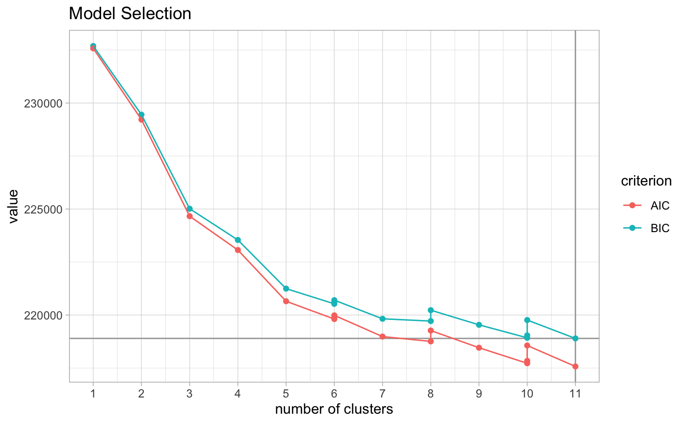

# Goal

This is a step-by-step guide for a complete analysis of mass cytometry data.

# Prerequisites

Install [R](https://www.r-project.org/) and [RStudio](https://www.rstudio.com/). Open this `Rmd` file in RStudio. Then run the following code to install all required packages.


```r
pkgs_needed = c("devtools","tidyverse","magrittr","FlowRepositoryR",
                "flowCore","openCyto","scales","parallel",
                "RColorBrewer","ggcorrplot","SummarizedExperiment",
                "lme4","lmerTest")
letsinstall = setdiff(pkgs_needed, installed.packages())
if (length(letsinstall) > 0) {
  BiocManager::install(letsinstall)
}
# package is still private
devtools::install_github("ChristofSeiler/CytoGLMM")
# Bioconductor version breaks when updating to ggplot2 v3.0
devtools::install_github("RGLab/ggcyto", ref="trunk")
```

Load packages.


```r
library("CytoGLMM")
library("tidyverse")
library("magrittr")
library("FlowRepositoryR")
library("flowCore")
library("openCyto")
library("ggcyto")
library("scales")
library("parallel")
library("RColorBrewer")
library("ggcorrplot")
library("SummarizedExperiment")
library("lme4")
library("lmerTest")
```

Set plotting style and assign computational resources.


```r
theme_set(theme_light())
ncores = parallel::detectCores()
```

# Download and Prepare Data

## FCS Files

Reanalysis of mass cytometry data from @aghaeepour2017immune. We use the package `FlowRepositoryR` to download `fcs` files from [FlowRepository](http://flowrepository.org/id/FR-FCM-ZY3Q). We download mass cytometry data measured on whole blood samples collected from 16 women during pregnancy stimulated with IFNa at first and third trimester.


```r
repo = flowRep.get("FR-FCM-ZY3Q")
data = download(repo, only.files = ".*_2_IFNa.*fcs")
data = download(repo, only.files = ".*_1_IFNa.*fcs")
data = download(repo, only.files = ".*_BL_IFNa.*fcs")
```

## Sample Table

The previous commands downloaded `fcs` files to the `FR-FCM-ZY3Q` folder. Now, we prepare the sample table by parsing the `fcs` filenames. For some studies, it might be easier to prepare a `sample_table.csv` textfile and load it using the `readr` package.


```r
fcs_files = list.files(path = "FR-FCM-ZY3Q/", pattern = "fcs")
map_time = function(x) {
  if (str_detect(x, "_2_")) "3rd trimester"
  else if (str_detect(x, "_1_")) "2st trimester"
  else if (str_detect(x, "_BL_")) "1st trimester"
  else NA
}
sample_table = tibble(
  donor = str_extract(fcs_files, "PTLG[0-9]{3}"),
  term = sapply(fcs_files, map_time) %>% as.factor,
  file_name = paste0("FR-FCM-ZY3Q/",fcs_files)
)
sample_table
```

```
## # A tibble: 48 x 3
##    donor   term          file_name                                
##    <chr>   <fct>         <chr>                                    
##  1 PTLG001 2st trimester FR-FCM-ZY3Q/Gates_PTLG001_1_IFNa_100.fcs 
##  2 PTLG001 3rd trimester FR-FCM-ZY3Q/Gates_PTLG001_2_IFNa_100.fcs 
##  3 PTLG001 1st trimester FR-FCM-ZY3Q/Gates_PTLG001_BL_IFNa_100.fcs
##  4 PTLG002 2st trimester FR-FCM-ZY3Q/Gates_PTLG002_1_IFNa_100.fcs 
##  5 PTLG002 3rd trimester FR-FCM-ZY3Q/Gates_PTLG002_2_IFNa_100.fcs 
##  6 PTLG002 1st trimester FR-FCM-ZY3Q/Gates_PTLG002_BL_IFNa_100.fcs
##  7 PTLG003 2st trimester FR-FCM-ZY3Q/Gates_PTLG003_1_IFNa_100.fcs 
##  8 PTLG003 3rd trimester FR-FCM-ZY3Q/Gates_PTLG003_2_IFNa_100.fcs 
##  9 PTLG003 1st trimester FR-FCM-ZY3Q/Gates_PTLG003_BL_IFNa_100.fcs
## 10 PTLG004 2st trimester FR-FCM-ZY3Q/Gates_PTLG004_1_IFNa_100.fcs 
## # … with 38 more rows
```

## Marker Table

Load marker isotopes and protein names. Make sure that marker names don't have `-` or start with a number. This is important to be compatible with the formula syntax of `R`.


```r
markers = read_csv("markers.csv")
markers$protein_name %<>% str_replace_all("-","_")
markers$protein_name %<>% make.names
markers
```

```
## # A tibble: 35 x 3
##    isotope      protein_name type     
##    <chr>        <chr>        <chr>    
##  1 Event_length Event_length none     
##  2 In113Di      CD235ab_CD61 phenotype
##  3 In115Di      CD45         phenotype
##  4 La139Di      CD66         phenotype
##  5 Pr141Di      CD7          phenotype
##  6 Nd142Di      CD19         phenotype
##  7 Nd143Di      CD45RA       phenotype
##  8 Nd144Di      CD11b        phenotype
##  9 Nd145Di      CD4          phenotype
## 10 Nd146Di      CD8a         phenotype
## # … with 25 more rows
```

Check if bead normalized. This only works if the bead normalizer added an additional column `beadDist` to the `fcs`.


```r
ifelse(sum(colnames(read.FCS(sample_table$file_name[1])) == "beadDist")==1,
       yes = "bead normalized",
       no = "not bead normalized")
```

```
## uneven number of tokens: 571
## The last keyword is dropped.
## uneven number of tokens: 571
## The last keyword is dropped.
```

```
## [1] "bead normalized"
```

# Gating

Gate with [openCyto](https://bioconductor.org/packages/release/bioc/html/openCyto.html) according to supplementary material (Fig. S1) from @aghaeepour2017immune.


```r
# load data
ncfs = read.ncdfFlowSet(sample_table$file_name, mc.cores = ncores)
```

```
## uneven number of tokens: 571
## The last keyword is dropped.
## uneven number of tokens: 571
## The last keyword is dropped.
```

```r
gs = GatingSet(ncfs)
pData(gs) = cbind(pData(gs),sample_table)
trans_func = function(x) asinh(x/5)
inv_func = function(x) 5*sinh(x)
trans_obj = trans_new("asinh_cytof", trans_func, inv_func)
translist = transformerList(markers$isotope[-1], trans_obj)
gs = transform(gs, translist)
# apply gating template
gt_aghaeepour = gatingTemplate("gating_template.csv")
plot(gt_aghaeepour)
```


```r
gt_gating(gt_aghaeepour, gs, mc.cores = ncores, parallel_type = "multicore")
# rename some subsets
gs_pop_set_name(gs, "/singlet/leukocyte/mononuclear/CD3+CD19-/CD4+CD8a-/CD45RA+",
                "CD4+Tnaive") %>% invisible
gs_pop_set_name(gs, "/singlet/leukocyte/mononuclear/CD3+CD19-/CD4+CD8a-/CD45RA-",
                "CD4+Tmem") %>% invisible
gs_pop_set_name(gs, "/singlet/leukocyte/mononuclear/CD3+CD19-/CD4-CD8a+/CD45RA+",
                "CD8+Tnaive") %>% invisible
gs_pop_set_name(gs, "/singlet/leukocyte/mononuclear/CD3+CD19-/CD4-CD8a+/CD45RA-",
                "CD8+Tmem") %>% invisible
gs_pop_set_name(gs, "CD3-CD19+", "B") %>% invisible
gs_pop_set_name(gs, "CD3+CD19-", "T") %>% invisible
gs_pop_set_name(gs, "CD4+CD8a-", "CD4+T") %>% invisible
gs_pop_set_name(gs, "CD4-CD8a+", "CD8+T") %>% invisible
gs_pop_set_name(gs, "CD7+", "NK") %>% invisible
gs_pop_set_name(gs, "CD14+CD16-", "cMC") %>% invisible
gs_pop_set_name(gs, "CD14-CD16+", "ncMC") %>% invisible
gs_pop_set_name(gs, "CD14+CD16+", "intMC") %>% invisible
plot(gs)
```


```r
# hide nodes
nodes_to_hide = c(
  "granulocyte", "CD19+", "CD3+", "CD3+CD19+",
  "CD8a+", "CD4+", "CD16+", "CD14+", "CD14-CD16-",
  "CD4+CD8a+", "CD4+Tnaive/CD25+", "CD4+Tmem/CD25+",
  "CD4+Tnaive/FoxP3+", "CD4+Tmem/FoxP3+"
  )
for(this_node in nodes_to_hide) setNode(gs, this_node, FALSE)
plot(gs)
```


Visualize gates with [ggcyto](https://bioconductor.org/packages/release/bioc/html/ggcyto.html).


```r
set.seed(0xdada)
ids = sample(length(gs), size = 6)
ggcyto(gs[ids], aes(x = CD66, y = CD45), subset = "leukocyte") +
  ggcyto_par_set(limits = "instrument") + geom_hex(bins = 64) +
  geom_gate(c("mononuclear","granulocyte"))
```


```r
ggcyto(gs[ids], aes(x = CD3, y = CD19), subset = "mononuclear") +
  ggcyto_par_set(limits = "instrument") + geom_hex(bins = 64) +
  geom_gate(c("B","T","CD3-CD19-"))
```


```r
ggcyto(gs[ids], aes(x = CD14, y = CD7), subset = "CD3-CD19-") +
  ggcyto_par_set(limits = "instrument") + geom_hex(bins = 64) +
  geom_gate("NK")
```


```r
ggcyto(gs[ids], aes(x = CD14, y = CD16), subset = "CD7-") +
  ggcyto_par_set(limits = "instrument") + geom_hex(bins = 64) +
  geom_gate(c("cMC","ncMC","intMC"))
```



```r
ggcyto(gs[ids], aes(x = CD4, y = CD8a), subset = "T") +
  ggcyto_par_set(limits = "instrument") + geom_hex(bins = 64) +
  geom_gate(c("CD4+T","CD8+T","CD4-CD8a-"))
```



```r
ggcyto(gs[ids], aes(x = TCRgd, y = CD3), subset = "CD4-CD8a-") +
  ggcyto_par_set(limits = "instrument") + geom_hex(bins = 64) +
  geom_gate("gdT")
```


```r
ggcyto(gs[ids], aes(x = CD4, y = CD45RA), subset = "CD4+T") +
  ggcyto_par_set(limits = "instrument") + geom_hex(bins = 64) +
  geom_gate(c("CD4+Tnaive","CD4+Tmem"))
```


```r
ggcyto(gs[ids], aes(x = FoxP3, y = CD25), subset = "CD4+Tnaive") +
  ggcyto_par_set(limits = "instrument") + geom_hex(bins = 64) +
  geom_gate("Tregsnaive")
```


```r
ggcyto(gs[ids], aes(x = FoxP3, y = CD25), subset = "CD4+Tmem") +
  ggcyto_par_set(limits = "instrument") + geom_hex(bins = 64) +
  geom_gate("Tregsmem")
```


```r
ggcyto(gs[ids], aes(x = CD8a, y = CD45RA), subset = "CD8+T") +
  ggcyto_par_set(limits = "instrument") + geom_hex(bins = 64) +
  geom_gate(c("CD8+Tnaive","CD8+Tmem"))
```


Combine cell types of interest into one data frame. Change marker name from isotope name to protein name and remove markers that are unmapped.


```r
nodes_exclude = c("root","singlet","leukocyte","mononuclear",
                  "CD3-CD19-","CD7-","CD4-CD8a-",
                  "CD4+T","CD8+T","T")
nodes_all = gs_get_pop_paths(gs, path = "auto")
nodes_select = nodes_all[!nodes_all %in% nodes_exclude]
df_samples = lapply(nodes_select, function(celltype) {
  fset = gs_pop_get_data(gs, celltype)
  lapply(seq(fset), function(sample_id) {
    marker_ids = which(fset@origColnames %in% markers$isotope)
    exprs = as_tibble(exprs(fset[[sample_id]]))[,marker_ids]
    file_name = pData(fset[sample_id])$file_name
    exprs %>% add_column(file_name, celltype)
  }) %>% bind_rows
}) %>% bind_rows
df_samples %<>% inner_join(sample_table,by = "file_name")
oldnames = markers$isotope
newnames = markers$protein_name
df_samples %<>% rename_at(vars(all_of(oldnames)), ~ newnames)
str(df_samples)
```

```
## tibble [3,669,504 × 39] (S3: tbl_df/tbl/data.frame)
##  $ Event_length: num [1:3669504] 33 26 21 51 55 32 66 27 35 55 ...
##  $ CD235ab_CD61: num [1:3669504] 0 0.0736 0.3772 0 0 ...
##  $ CD45        : num [1:3669504] 4.08 4.13 5.03 4.47 4.68 ...
##  $ CD66        : num [1:3669504] 0.538 1.082 1.312 0.261 1.083 ...
##  $ CD7         : num [1:3669504] 5.2 4.08 4.63 5.39 6.05 ...
##  $ CD19        : num [1:3669504] 0.134 0.169 1.176 1.116 0.199 ...
##  $ CD45RA      : num [1:3669504] 4.237 3.443 3.842 4.319 0.241 ...
##  $ CD11b       : num [1:3669504] 2.7 2.07 1.92 2.49 1.9 ...
##  $ CD4         : num [1:3669504] 0.2652 0 0 0.0955 0.1431 ...
##  $ CD8a        : num [1:3669504] 0.2344 0.0158 0.7656 0 0.2404 ...
##  $ CD11c       : num [1:3669504] 2.184 2.21 1.91 0.213 2.85 ...
##  $ CD123       : num [1:3669504] 0.0249 0 0.0688 0.3725 0.0723 ...
##  $ pCREB       : num [1:3669504] 1.526 1.36 1.668 0.947 0.812 ...
##  $ pSTAT5      : num [1:3669504] 2.19 1.16 1.54 1.68 2.02 ...
##  $ pP38        : num [1:3669504] 0.286 0.348 0.797 0.862 0.724 ...
##  $ TCRgd       : num [1:3669504] 0.3318 0.2139 0 0.0761 0 ...
##  $ pSTAT1      : num [1:3669504] 3.46 2.7 3.77 3.14 2.92 ...
##  $ pSTAT3      : num [1:3669504] 2.27 2.22 1.75 2.07 2.13 ...
##  $ prpS6       : num [1:3669504] 1.234 0.439 0.296 1.481 0 ...
##  $ CD33        : num [1:3669504] 1.2231 0.0593 0.1261 0.6798 0.6141 ...
##  $ pMAPKAPK    : num [1:3669504] 1.78 2.01 2.51 2.51 1.95 ...
##  $ Tbet2       : num [1:3669504] 2.24 2.74 3.76 3.08 2.59 ...
##  $ FoxP3       : num [1:3669504] 0.947 0.471 0.489 1.066 0.901 ...
##  $ IkB         : num [1:3669504] 1.024 0.906 1.075 1.161 1.343 ...
##  $ CD16        : num [1:3669504] 0.1013 0.1794 0 0.144 0.0644 ...
##  $ pNFkB       : num [1:3669504] 1.121 1.712 0.945 2.037 1.435 ...
##  $ pERK1_2     : num [1:3669504] 0.1168 0 0.2711 0 0.0282 ...
##  $ CD25        : num [1:3669504] 0 0 0.183 0.243 0 ...
##  $ CD3         : num [1:3669504] 0.364 0 0 0 0 ...
##  $ CD15        : num [1:3669504] 0.115 0.946 0.367 0.248 0.497 ...
##  $ HLA_DR      : num [1:3669504] 2.127 1.535 0.201 0.531 1.101 ...
##  $ CD14        : num [1:3669504] 0.143 0 0 0 0 ...
##  $ CD56        : num [1:3669504] 4.82 2.8 3.68 3.89 5.25 ...
##  $ DNA1        : num [1:3669504] 3.33 3.83 4.36 3.76 3.87 ...
##  $ DNA2        : num [1:3669504] 4.2 4.25 4.9 4.44 4.55 ...
##  $ file_name   : chr [1:3669504] "FR-FCM-ZY3Q/Gates_PTLG001_1_IFNa_100.fcs" "FR-FCM-ZY3Q/Gates_PTLG001_1_IFNa_100.fcs" "FR-FCM-ZY3Q/Gates_PTLG001_1_IFNa_100.fcs" "FR-FCM-ZY3Q/Gates_PTLG001_1_IFNa_100.fcs" ...
##  $ celltype    : chr [1:3669504] "NK" "NK" "NK" "NK" ...
##  $ donor       : chr [1:3669504] "PTLG001" "PTLG001" "PTLG001" "PTLG001" ...
##  $ term        : Factor w/ 3 levels "1st trimester",..: 2 2 2 2 2 2 2 2 2 2 ...
##   ..- attr(*, "names")= chr [1:3669504] "Gates_PTLG001_1_IFNa_100.fcs" "Gates_PTLG001_1_IFNa_100.fcs" "Gates_PTLG001_1_IFNa_100.fcs" "Gates_PTLG001_1_IFNa_100.fcs" ...
```

List cell counts per donor and trimester.


```r
table(df_samples$donor,df_samples$term)
```

```
##          
##           1st trimester 2st trimester 3rd trimester
##   PTLG001         82937         61408         80265
##   PTLG002         66573         92982         74721
##   PTLG003        108142         80475         75041
##   PTLG004         48169         66194         57682
##   PTLG005         81455         79486         87003
##   PTLG007        115016         98249        135821
##   PTLG008         83824         88448         73391
##   PTLG009        103724         83306         96440
##   PTLG010         58504         68719         76391
##   PTLG012         72357         62635         68484
##   PTLG018         66348         86527         92544
##   PTLG019         78024         74177         71328
##   PTLG020         44037         37367         49138
##   PTLG022         89129         52931         70198
##   PTLG024        117099         77125         79094
##   PTLG029         54313         56368         45915
```

Plot abundance of each celltype per sample.


```r
df_abundance = df_samples %>%
  group_by(file_name, donor, term, celltype) %>%
  tally()
ggplot(df_abundance, aes(term, n, color = term)) +
  geom_violin() +
  geom_jitter(width = 0.2, alpha = 0.5) +
  facet_wrap(~celltype, nrow = 2) +
  theme(axis.text.x = element_blank())
```


Focus on functional proteins.


```r
protein_names = markers %>%
  dplyr::filter(type == "function") %>%
  .$protein_name
protein_names
```

```
##  [1] "pCREB"    "pSTAT5"   "pP38"     "pSTAT1"   "pSTAT3"   "prpS6"    "pMAPKAPK" "IkB"      "pNFkB"   
## [10] "pERK1_2"
```

Declare the columns in `df_samples` that are not protein markers. In our example, we have donor ID, time point when the sample was collected, `FCS` filename, and the cell type that we have defined through gating.


```r
sample_info_names = c(names(sample_table),"celltype")
sample_info_names
```

```
## [1] "donor"     "term"      "file_name" "celltype"
```

# Data Exploration

## MDS

MDS on median marker expression of all cell types following @Nowicka2017cytof.


```r
CytoGLMM::plot_mds(df_samples,
                   protein_names = protein_names,
                   sample_info_names = sample_info_names,
                   color = "celltype")
```


Subset to NK cells to illustrate visualization for one cell type.


```r
df_samples_subset = df_samples %>% dplyr::filter(celltype == "NK")
```

MDS on median marker expression of NK cells.


```r
CytoGLMM::plot_mds(df_samples_subset,
                   protein_names = protein_names,
                   sample_info_names = sample_info_names,
                   color = "term")
```


## Heatmap

Heatmap of median marker expression of all cell types following @Nowicka2017cytof.


```r
CytoGLMM::plot_heatmap(df_samples,
                       protein_names = protein_names,
                       sample_info_names = sample_info_names,
                       arrange_by_1 = "term",
                       arrange_by_2 = "celltype")
```

Heatmap of median marker expression of NK cells.


```r
CytoGLMM::plot_heatmap(df_samples_subset,
                       protein_names = protein_names,
                       sample_info_names = sample_info_names,
                       arrange_by_1 = "term")
```

## PCA

PCA plot of all cell types.


```r
CytoGLMM::plot_prcomp(df_samples,
                      protein_names = protein_names,
                      color_var = "celltype",
                      repel = TRUE)
```



PCA plot of NK cells.


```r
CytoGLMM::plot_prcomp(df_samples_subset,
                      protein_names = protein_names,
                      color_var = "term",
                      repel = TRUE)
```


## LDA

LDA plot of NK cells.


```r
CytoGLMM::plot_lda(df_samples_subset,
                   protein_names,
                   group = "term",
                   cor_scaling_factor = 2.5,
                   arrow_color = "black",
                   marker_color = "black",
                   marker_size = 4)
```


## Density Plots

Density plots of one marker for all donors.


```r
ggplot(df_samples_subset, aes_string(x = "pCREB", color = "term")) +
  geom_density() +
  facet_wrap(~donor)
```


## Two-Dimensional Histograms

Two-dimensional histograms for plotting two markers for all donors.


```r
colorscale = scale_fill_gradientn(
  colors = rev(brewer.pal(9, "YlGnBu")),
  values = c(0, exp(seq(-5, 0, length.out = 100)))
  )
ggplot(df_samples_subset, aes_string(x = "pSTAT1", y = "pSTAT3")) +
  geom_hex(bins = 64) +
  colorscale +
  coord_fixed() +
  facet_wrap(~donor)
```


Two-dimensional histograms for group comparisons.


```r
ggplot(df_samples_subset, aes_string(x = "pSTAT1", y = "pSTAT3")) +
  geom_hex(bins = 64) +
  colorscale +
  coord_fixed() +
  facet_wrap(~term)
```


NK cell count. List the smallest and largest.


```r
df_samples_subset %>% group_by(term,donor) %>% tally %>% arrange(n)
```

```
## # A tibble: 48 x 3
## # Groups:   term [3]
##    term          donor       n
##    <fct>         <chr>   <int>
##  1 2st trimester PTLG020  1759
##  2 3rd trimester PTLG024  2380
##  3 2st trimester PTLG024  2738
##  4 2st trimester PTLG001  2910
##  5 3rd trimester PTLG001  3125
##  6 3rd trimester PTLG020  3230
##  7 1st trimester PTLG020  3412
##  8 1st trimester PTLG001  3474
##  9 3rd trimester PTLG009  3764
## 10 2st trimester PTLG009  4004
## # … with 38 more rows
```

```r
df_samples_subset %>% group_by(term,donor) %>% tally %>% arrange(desc(n))
```

```
## # A tibble: 48 x 3
## # Groups:   term [3]
##    term          donor       n
##    <fct>         <chr>   <int>
##  1 2st trimester PTLG008 13956
##  2 1st trimester PTLG008 13395
##  3 2st trimester PTLG029  9104
##  4 2st trimester PTLG002  9037
##  5 1st trimester PTLG022  8222
##  6 1st trimester PTLG003  8087
##  7 3rd trimester PTLG008  7953
##  8 2st trimester PTLG018  7781
##  9 3rd trimester PTLG018  7620
## 10 2st trimester PTLG004  7579
## # … with 38 more rows
```

## Marker Correlations

Plot marker correlations.


```r
mcor = cor(df_samples_subset %>% dplyr::select(protein_names))
ggcorrplot(mcor, hc.order = TRUE, type = "lower",
           outline.col = "lightgray",
           colors = c("#6D9EC1", "white", "#E46726"))
```


# Regression Analysis on Summarized Data

Classical differential analysis approach comparing median marker expressions [@Nowicka2017cytof].

## Plot Median Marker Expression

Plot all celltypes.


```r
df_median = df_samples %>%
      group_by(file_name, donor, term, celltype) %>%
      summarise_at(protein_names, median)
df_median_long = gather(df_median, protein_name, median_expr,
                        -file_name, -donor, -term, -celltype)
ggplot(df_median_long, aes(protein_name, median_expr, color = term)) +
  geom_violin() +
  facet_wrap(~celltype) +
  theme(axis.text.x  = element_text(angle = 90, vjust=0))
```


Zoom in on NK cells.


```r
df_median_long %<>% dplyr::filter(celltype == "NK")
ggplot(df_median_long, aes(term, median_expr, color = term)) +
  geom_violin() +
  geom_jitter(width = 0.2, alpha = 0.5) +
  facet_wrap(~ protein_name, nrow = 2) +
  theme(axis.text.x = element_blank()) +
  ggtitle("NK")
```



Zoom in on marker pSTAT1.


```r
ggplot(df_median, aes(term, pSTAT1, color = term)) +
  geom_violin() +
  geom_jitter(width = 0.2, alpha = 0.5) +
  facet_wrap(~celltype, nrow = 2) +
  theme(axis.text.x = element_blank())
```



## Linear Mixed Model

Mixed model with median expression as response variable, experimental condition as explanatory variable, and donor as random effect. Fit separate models for each protein and celltype combination.


```r
calc_pvalue = function(fit) {
  summ = summary(fit)
  coefficients(summ)["term3rd trimester", "Pr(>|t|)"]
}
df_median_long = gather(df_median, protein_name, median_expr,
                        -file_name, -donor, -term, -celltype)
df_fits = df_median_long %>%
  group_by(protein_name, celltype) %>%
  nest() %>%
  mutate(fit = map(data, ~ lmer(median_expr ~ term + (1|donor), .))) %>%
  mutate(pvalue_unadj = map_dbl(fit, ~ calc_pvalue(.))) %>%
  mutate(pvalue_adj = p.adjust(pvalue_unadj, method = "BH")) %>%
  dplyr::select(protein_name, celltype, pvalue_adj)
df_fits %>%
  dplyr::filter(pvalue_adj < 0.05) %>%
  dplyr::arrange(celltype) %>%
  print(n = Inf)
```

```
## # A tibble: 45 x 3
## # Groups:   celltype, protein_name [45]
##    protein_name celltype      pvalue_adj
##    <chr>        <chr>              <dbl>
##  1 pSTAT1       B          0.00223      
##  2 pMAPKAPK     B          0.0297       
##  3 pNFkB        B          0.0115       
##  4 pERK1_2      B          0.0310       
##  5 pSTAT5       CD4+Tmem   0.0194       
##  6 pSTAT1       CD4+Tmem   0.0000128    
##  7 IkB          CD4+Tmem   0.0183       
##  8 pNFkB        CD4+Tmem   0.0000356    
##  9 pERK1_2      CD4+Tmem   0.00748      
## 10 pCREB        CD4+Tnaive 0.00146      
## 11 pSTAT5       CD4+Tnaive 0.000983     
## 12 pP38         CD4+Tnaive 0.0311       
## 13 pSTAT1       CD4+Tnaive 0.0000829    
## 14 prpS6        CD4+Tnaive 0.0184       
## 15 IkB          CD4+Tnaive 0.000118     
## 16 pNFkB        CD4+Tnaive 0.0000421    
## 17 pSTAT5       CD8+Tmem   0.0364       
## 18 pSTAT1       CD8+Tmem   0.0000946    
## 19 pSTAT3       CD8+Tmem   0.0440       
## 20 pNFkB        CD8+Tmem   0.00662      
## 21 pERK1_2      CD8+Tmem   0.0142       
## 22 pCREB        CD8+Tnaive 0.0164       
## 23 pSTAT5       CD8+Tnaive 0.00223      
## 24 pP38         CD8+Tnaive 0.0437       
## 25 pSTAT1       CD8+Tnaive 0.00000453   
## 26 prpS6        CD8+Tnaive 0.00421      
## 27 pMAPKAPK     CD8+Tnaive 0.0328       
## 28 IkB          CD8+Tnaive 0.00618      
## 29 pNFkB        CD8+Tnaive 0.000159     
## 30 pERK1_2      CD8+Tnaive 0.0356       
## 31 pSTAT1       cMC        0.000489     
## 32 pNFkB        cMC        0.0232       
## 33 pSTAT1       gdT        0.0236       
## 34 prpS6        gdT        0.0452       
## 35 prpS6        intMC      0.0374       
## 36 pSTAT5       ncMC       0.0454       
## 37 IkB          ncMC       0.0204       
## 38 pERK1_2      ncMC       0.0175       
## 39 pSTAT1       NK         0.00000000684
## 40 pNFkB        NK         0.00126      
## 41 pERK1_2      NK         0.00281      
## 42 pSTAT1       Tregsmem   0.000276     
## 43 pNFkB        Tregsmem   0.0158       
## 44 pSTAT1       Tregsnaive 0.00517      
## 45 pNFkB        Tregsnaive 0.0159
```

# Regression Analysis on All The Data

For the regression analysis, we will focus only on NK cells, and compare the first and third trimester. We can repeat the same analysis for each cell type of interest, and trimester combination.


```r
df_samples_subset %<>% dplyr::filter(term != "2st trimester")
df_samples_subset$term %<>% droplevels
df_samples_subset$term %<>% factor(levels = c("1st trimester",
                                              "3rd trimester"))
```

## Generalized Linear Mixed Model

Fit a Generalized Linear Mixed Model (GLMM) with donor random effects. This function is a wrapper around the package `mbest` [@perry2017fast].


```r
glmm_fit = CytoGLMM::cytoglmm(df_samples_subset,
                              protein_names = protein_names,
                              condition = "term", group = "donor")
glmm_fit
```

```
## number of cells per group and condition:         
##           1st trimester 3rd trimester
##   PTLG001          3474          3125
##   PTLG002          5438          6120
##   PTLG003          8087          5035
##   PTLG004          4991          6501
##   PTLG005          6105          5074
##   PTLG007          5766          5302
##   PTLG008         13395          7953
##   PTLG009          5177          3764
##   PTLG010          4273          4908
##   PTLG012          6624          5643
##   PTLG018          4083          7620
##   PTLG019          6671          4542
##   PTLG020          3412          3230
##   PTLG022          8222          5709
##   PTLG024          4100          2380
##   PTLG029          7211          4937
## 
## proteins included in the analysis:
##  pCREB pSTAT5 pP38 pSTAT1 pSTAT3 prpS6 pMAPKAPK IkB pNFkB pERK1_2 
## 
## condition compared: term 
## grouping variable: donor
```

```r
plot(glmm_fit)
```


```r
summary(glmm_fit) %>% dplyr::filter(pvalues_adj < 0.05)
```

```
## # A tibble: 3 x 3
##   protein_name pvalues_unadj pvalues_adj
##   <chr>                <dbl>       <dbl>
## 1 pSTAT3            6.18e-21    6.18e-20
## 2 pSTAT1            6.58e-19    3.29e-18
## 3 pSTAT5            7.47e- 9    2.49e- 8
```

Add pSTAT1, pSTAT3, and pSTAT5 into one marker.


```r
df_samples_subset %<>% mutate(pSTAT_sum = pSTAT1+pSTAT3+pSTAT5)
protein_names_sum = c(
  "pSTAT_sum",
  protein_names[!protein_names %in% c("pSTAT1","pSTAT3","pSTAT5")]
)
glmm_fit = CytoGLMM::cytoglmm(df_samples_subset,
                              protein_names = protein_names_sum,
                              condition = "term", group = "donor")
plot(glmm_fit)
```


```r
summary(glmm_fit) %>% dplyr::filter(pvalues_adj < 0.05)
```

```
## # A tibble: 1 x 3
##   protein_name pvalues_unadj pvalues_adj
##   <chr>                <dbl>       <dbl>
## 1 pSTAT_sum      0.000000189  0.00000151
```

Take differences between pSTAT1, pSTAT3, and pSTAT5.


```r
df_samples_subset %<>% mutate(pSTAT3_minus_pSTAT1 = pSTAT3-pSTAT1)
df_samples_subset %<>% mutate(pSTAT5_minus_pSTAT1 = pSTAT5-pSTAT1)
protein_names_diff = c(
  "pSTAT3_minus_pSTAT1","pSTAT5_minus_pSTAT1",
  protein_names[!protein_names %in% c("pSTAT3","pSTAT5")]
)
glmm_fit = CytoGLMM::cytoglmm(df_samples_subset,
                              protein_names = protein_names_diff,
                              condition = "term", group = "donor")
plot(glmm_fit)
```


```r
summary(glmm_fit) %>% dplyr::filter(pvalues_adj < 0.05)
```

```
## # A tibble: 3 x 3
##   protein_name        pvalues_unadj pvalues_adj
##   <chr>                       <dbl>       <dbl>
## 1 pSTAT3_minus_pSTAT1      6.18e-21    6.18e-20
## 2 pSTAT5_minus_pSTAT1      7.47e- 9    3.74e- 8
## 3 pSTAT1                   2.19e- 4    7.31e- 4
```

Add interactions between pSTAT1, pSTAT3, and pSTAT5.


```r
df_samples_subset %<>% mutate(pSTAT_I15 = pSTAT1*pSTAT5)
df_samples_subset %<>% mutate(pSTAT_I35 = pSTAT3*pSTAT5)
df_samples_subset %<>% mutate(pSTAT_I13 = pSTAT1*pSTAT3)
df_samples_subset %<>% mutate(pSTAT_I135 = pSTAT1*pSTAT3*pSTAT5)
protein_names_interactions = c(protein_names,"pSTAT_I15","pSTAT_I35",
                               "pSTAT_I13","pSTAT_I135")
glmm_fit = CytoGLMM::cytoglmm(df_samples_subset,
                              protein_names = protein_names_interactions,
                              condition = "term", group = "donor")
plot(glmm_fit)
```


```r
summary(glmm_fit) %>% dplyr::filter(pvalues_adj < 0.05)
```

```
## # A tibble: 6 x 3
##   protein_name pvalues_unadj pvalues_adj
##   <chr>                <dbl>       <dbl>
## 1 pSTAT3            2.52e-13    3.53e-12
## 2 pSTAT1            3.47e-11    2.43e-10
## 3 pSTAT_I13         1.82e- 4    8.48e- 4
## 4 pERK1_2           1.55e- 2    4.82e- 2
## 5 pNFkB             1.90e- 2    4.82e- 2
## 6 pSTAT5            2.06e- 2    4.82e- 2
```

## Generalized Linear Model with Bootstrap

Instead of modeling the donor effect, we can use bootstrap resampling. In our experience, this type of regression gives also good results when samples are not matched between conditions on the same donor.


```r
glm_fit = CytoGLMM::cytoglm(df_samples_subset,
                            num_boot = 1000,
                            protein_names = protein_names,
                            condition = "term", group = "donor")
glm_fit
```

```
## 
## #######################
## ## paired analysis ####
## #######################
## 
## number of bootstrap samples: 1000 
## 
## number of cells per group and condition:         
##           1st trimester 3rd trimester
##   PTLG001          3474          3125
##   PTLG002          5438          6120
##   PTLG003          8087          5035
##   PTLG004          4991          6501
##   PTLG005          6105          5074
##   PTLG007          5766          5302
##   PTLG008         13395          7953
##   PTLG009          5177          3764
##   PTLG010          4273          4908
##   PTLG012          6624          5643
##   PTLG018          4083          7620
##   PTLG019          6671          4542
##   PTLG020          3412          3230
##   PTLG022          8222          5709
##   PTLG024          4100          2380
##   PTLG029          7211          4937
## 
## proteins included in the analysis:
##  pCREB pSTAT5 pP38 pSTAT1 pSTAT3 prpS6 pMAPKAPK IkB pNFkB pERK1_2 
## 
## condition compared: term 
## grouping variable: donor
```

```r
plot(glm_fit)
```



```r
summary(glm_fit) %>% dplyr::filter(pvalues_adj < 0.05)
```

```
## # A tibble: 3 x 3
##   protein_name pvalues_unadj pvalues_adj
##   <chr>                <dbl>       <dbl>
## 1 pSTAT1               0.002     0.00667
## 2 pSTAT3               0.002     0.00667
## 3 pSTAT5               0.002     0.00667
```

## Mixture of Regressions

Fit a mixture of regression model to identity clusters of donors or outliers. This function is a wrapper around the package `flexmix` [@grun2007fitting].


```r
num_donors = nlevels(as.factor(df_samples_subset$donor))
mix_fit = CytoGLMM::cytoflexmix(df_samples_subset,
                                protein_names = protein_names,
                                condition = "term", group = "donor",
                                ks = 1:num_donors)
plot(mix_fit)
```



The plotting function automatically uses the BIC criterion to select the number of clusters. In this case, it picks 10 clusters.


```r
plot_model_selection(mix_fit)
```



# SummarizedExperiment

We create a ``SummarizedExperiment`` object containing marker, sample table, and untransformed protein counts. This way we can store all the information of this experiment in one file and load it again in subsequent analyses.


```r
markers %<>% dplyr::filter(type != "none")
d_combined = df_samples %>%
  dplyr::select(markers$protein_name) %>%
  dplyr::mutate_all(.funs = inv_func) %>%
  dplyr::mutate_all(.funs = round) %>%
  as.matrix
row_data = df_samples %>%
  dplyr::select(sample_info_names) %>%
  as.data.frame
col_data = markers %>% as.data.frame
se_aghaeepour2017immune = SummarizedExperiment(
  assays = list(exprs = d_combined),
  colData = col_data,
  rowData = row_data
)
save(se_aghaeepour2017immune, file = "se_aghaeepour2017immune.Rdata")
```

# Session Info {.unnumbered}


```r
sessionInfo()
```

```
## R version 3.6.2 (2019-12-12)
## Platform: x86_64-apple-darwin15.6.0 (64-bit)
## Running under: macOS  10.16
## 
## Matrix products: default
## LAPACK: /Library/Frameworks/R.framework/Versions/3.6/Resources/lib/libRlapack.dylib
## 
## locale:
## [1] en_US.UTF-8/en_US.UTF-8/en_US.UTF-8/C/en_US.UTF-8/en_US.UTF-8
## 
## attached base packages:
##  [1] grid      stats4    parallel  stats     graphics  grDevices utils     datasets  methods   base     
## 
## other attached packages:
##  [1] Rgraphviz_2.30.0            graph_1.64.0                lmerTest_3.1-1             
##  [4] lme4_1.1-23                 Matrix_1.2-18               SummarizedExperiment_1.16.1
##  [7] DelayedArray_0.12.2         BiocParallel_1.20.1         matrixStats_0.56.0         
## [10] Biobase_2.46.0              GenomicRanges_1.38.0        GenomeInfoDb_1.22.0        
## [13] IRanges_2.20.2              S4Vectors_0.24.3            BiocGenerics_0.32.0        
## [16] ggcorrplot_0.1.3            RColorBrewer_1.1-2          scales_1.1.1               
## [19] ggcyto_1.14.1               flowWorkspace_3.34.1        ncdfFlow_2.32.0            
## [22] BH_1.72.0-3                 RcppArmadillo_0.9.880.1.0   openCyto_1.24.0            
## [25] flowCore_1.52.1             FlowRepositoryR_1.18.0      knitr_1.28                 
## [28] logging_0.10-108            MASS_7.3-51.5               magrittr_1.5               
## [31] forcats_0.5.0               stringr_1.4.0               dplyr_1.0.0                
## [34] purrr_0.3.4                 readr_1.3.1                 tidyr_1.1.0                
## [37] tibble_3.0.1                ggplot2_3.3.2               tidyverse_1.3.0            
## [40] CytoGLMM_0.1.0              Rcpp_1.0.4.6               
## 
## loaded via a namespace (and not attached):
##   [1] utf8_1.1.4             R.utils_2.9.2          ks_1.11.7              tidyselect_1.1.0      
##   [5] pROC_1.16.1            munsell_0.5.0          codetools_0.2-16       statmod_1.4.34        
##   [9] withr_2.2.0            colorspace_1.4-1       flowViz_1.50.0         highr_0.8             
##  [13] rstudioapi_0.11        flowClust_3.24.0       robustbase_0.93-5      ggsignif_0.6.0        
##  [17] labeling_0.3           GenomeInfoDbData_1.2.2 mnormt_1.5-6           farver_2.0.3          
##  [21] pheatmap_1.0.12        rprojroot_1.3-2        vctrs_0.3.0            generics_0.0.2        
##  [25] ipred_0.9-9            xfun_0.12              R6_2.4.1               doParallel_1.0.15     
##  [29] clue_0.3-57            isoband_0.2.1          flexmix_2.3-15         bitops_1.0-6          
##  [33] assertthat_0.2.1       nnet_7.3-12            gtable_0.3.0           processx_3.4.2        
##  [37] sandwich_2.5-1         timeDate_3043.102      rlang_0.4.6            mbest_0.6             
##  [41] splines_3.6.2          ModelMetrics_1.2.2.1   hexbin_1.28.1          broom_0.7.4           
##  [45] BiocManager_1.30.10    yaml_2.2.1             reshape2_1.4.4         abind_1.4-5           
##  [49] modelr_0.1.6           backports_1.1.7        rsconnect_0.8.16       IDPmisc_1.1.20        
##  [53] RBGL_1.62.1            caret_6.0-85           tools_3.6.2            lava_1.6.6            
##  [57] ellipsis_0.3.1         plyr_1.8.6             zlibbioc_1.32.0        RCurl_1.98-1.1        
##  [61] ps_1.3.3               ggpubr_0.2.5           rpart_4.1-15           cowplot_1.0.0         
##  [65] zoo_1.8-7              haven_2.3.1            ggrepel_0.8.2          cluster_2.1.0         
##  [69] fs_1.4.1               factoextra_1.0.6       fda_2.4.8.1            data.table_1.12.8     
##  [73] reprex_0.3.0           mvtnorm_1.0-12         packrat_0.5.0          hms_0.5.3             
##  [77] evaluate_0.14          XML_3.99-0.3           jpeg_0.1-8.1           mclust_5.4.5          
##  [81] readxl_1.3.1           gridExtra_2.3          compiler_3.6.2         ellipse_0.4.1         
##  [85] flowStats_3.44.0       KernSmooth_2.23-16     crayon_1.3.4           htmltools_0.4.0       
##  [89] minqa_1.2.4            R.oo_1.23.0            corpcor_1.6.9          pcaPP_1.9-73          
##  [93] rrcov_1.5-2            speedglm_0.3-2         RcppParallel_5.0.1     lubridate_1.7.4       
##  [97] DBI_1.1.0              dbplyr_1.4.2           boot_1.3-24            BiocStyle_2.14.4      
## [101] cli_2.0.2              R.methodsS3_1.8.0      gower_0.2.1            pkgconfig_2.0.3       
## [105] bigmemory.sri_0.1.3    pkgdown_1.5.1          numDeriv_2016.8-1.1    recipes_0.1.9         
## [109] xml2_1.3.1             foreach_1.4.8          XVector_0.26.0         prodlim_2019.11.13    
## [113] rvest_0.3.5            callr_3.4.3            digest_0.6.25          strucchange_1.5-2     
## [117] rmarkdown_2.1          cellranger_1.1.0       curl_4.3               gtools_3.8.1          
## [121] modeltools_0.2-22      nloptr_1.2.2.1         lifecycle_0.2.0        nlme_3.1-144          
## [125] jsonlite_1.6.1         bigmemory_4.5.36       desc_1.2.0             fansi_0.4.1           
## [129] pillar_1.4.4           lattice_0.20-40        httr_1.4.1             DEoptimR_1.0-8        
## [133] survival_3.1-8         glue_1.4.1             png_0.1-7              iterators_1.0.12      
## [137] class_7.3-15           stringi_1.4.6          rematch2_2.1.2         latticeExtra_0.6-29   
## [141] memoise_1.1.0
```

# References {.unnumbered}
